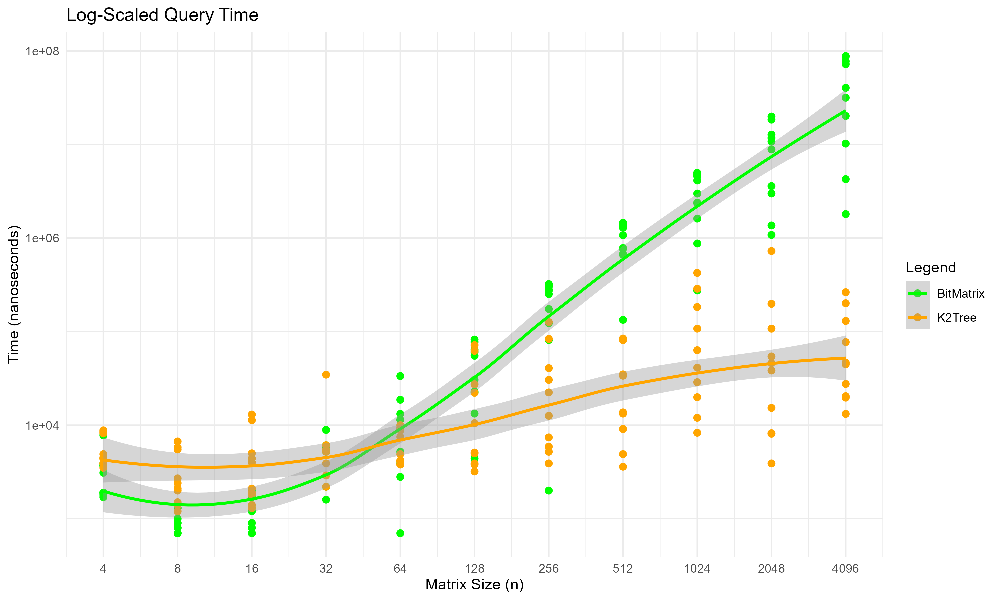
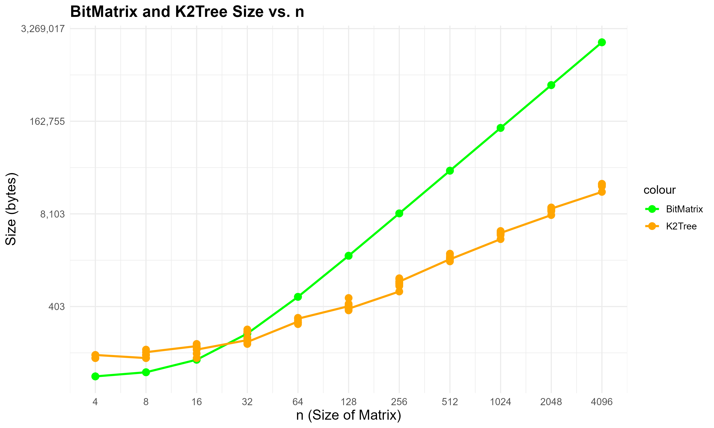

K2Tree
===
This is a Rust project which aims to test the performance of the K2-Tree data structure in terms of memory usage and
query speed in comparison to traditional bit matrices.

The original paper used as baseline for this project can be found
[here](docs/k2-Trees_for_Compact_Web_Graph_Representation.pdf). Within it, the authors describe the K2-Tree data
structure and its applications in the context of web graph representation.

## Compiling
To compile the project, simply run the following command:

```bash
cargo build --release
```

## Running
Once built, you may run the executable directly. The program will output the results to csv files into a directory
named `data/`.

The results are saved to a CSV file in the `data/` directory, which are then used to generate plots with R. If you
want to generate the plots, simply open `K2Tree.Rproj` with RStudio and run the script. The generated plots
will look as follows:

### Query Time



### Memory Usage



## Dependencies
### Rust
- [Rust](https://www.rust-lang.org/tools/install)
- [Cargo](https://doc.rust-lang.org/cargo/getting-started/installation.html)

### R
- [R 4.0 or above](https://www.r-project.org/)

## Notes
This project was written as part of the Masters in Computer Science course "Advanced Data Structures and Algorithms" at
the University of the Bío-Bío.
